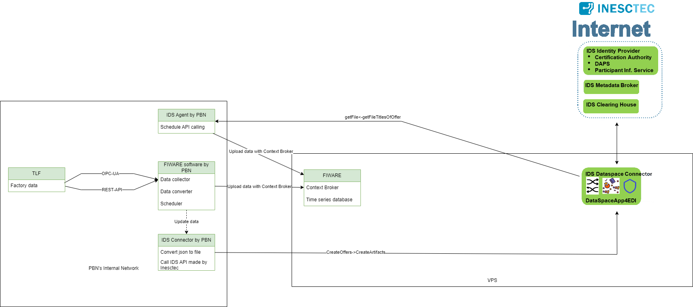

# Confacts 2 FIWARE Framework for IDS system

This folder contains a FIWARE-based framework for IDS system provided by [Inesc Tec](https://gitlab.inesctec.pt/ids/dataspace-4confacts).

## FIWARE-Based Framework

The FIWARE-based framework is designed to address specific challenges and facilitate efficient development using the FIWARE ecosystem. It consists of two major components:

### Data Collector and Uploader

The data collector and uploader component allow seamless integration with various data sources and are responsible for collecting and uploading data to the FIWARE platform. This component simplifies the process of data ingestion and ensures smooth data flow.

The data collector can be used with OPC-UA and RestAPI at the moment.

### IDS Agent

The IDS Agent is the second major component of the framework. This component plays a vital role getting data and updating it to FIWARE from Inesc [Inesc Tec](https://gitlab.inesctec.pt/ids/dataspace-4confacts) solution.

## Getting Started

To get started with the FIWARE framework image, please go through the following sessions:

-Edit the [IDS configuration](IDS_config.json)

-Edit the [FIWARE configuration](fiware_config.ini)

-Write the configuration files for data collection and upload at [configs](configs)

-Insert the configuration files for the IDS data collection to [config_receiver](config_receiver)

## License

This project is licensed by [PBN](https://www.pbn.hu/).

## Acknowledgments

Special thanks to [Péter Mátyás](https://www.linkedin.com/in/p%C3%A9ter-m%C3%A1ty%C3%A1s-a86aa4130), who started the whole FIWARE system integration back then at PBN.

Docker start:
-docker-compose up --build

server init:
-python orion_init.py
-python quantumleap_init.py
-python IDS_init.py

configuration files to edit:
-fiware_config.ini
-IDS_config.json
-files in configs and configs_receiver
