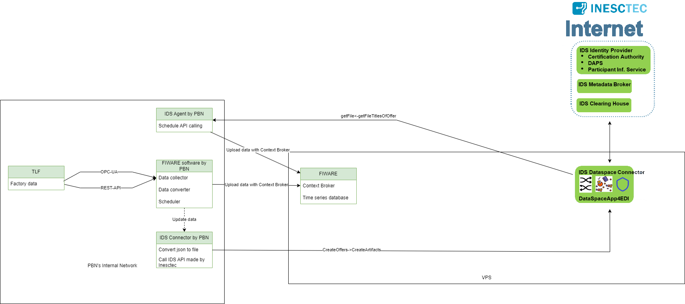

# Confacts 2 FIWARE Framework for IDS system

This repository contains a FIWARE Docker image and a FIWARE-based framework for IDS system provided by [Inesc Tec](https://gitlab.inesctec.pt/ids/dataspace-4confacts).

## FIWARE-Based Framework

The FIWARE-based framework is designed to address specific challenges and facilitate efficient development using the FIWARE ecosystem. It consists of two major components:

### Data Collector and Uploader

The data collector and uploader component allow seamless integration with various data sources and are responsible for collecting and uploading data to the FIWARE platform. This component simplifies the process of data ingestion and ensures smooth data flow.

### IDS Agent

The IDS Agent is the second major component of the framework. This component plays a vital role getting data and updating it to FIWARE from Inesc Tec IDS solution.

## FIWARE Image

The FIWARE Docker image included in this repository allows you to deploy and run FIWARE easily. It contains all the necessary dependencies and configurations to set up a functional FIWARE instance effortlessly.

## Getting Started

To get started with the FIWARE framework and Docker image, please refer to the following sections:

- [FIWARE Installation](FIWARE_Docker/FIWARE_IMAGE_README.md): Detailed instructions on how to install and set up the FIWARE solution using the provided Docker image.
- [FIWARE Framework_Installation](FIWARE_Framework/my_project/FIWARE_FRAMEWORK.md): Detailed instructions on how to install and set up the FIWARE framework using the provided Docker image.
- [Configuration](FIWARE_Framework/my_project/FIWARE_FRAMEWORK.md): A guide on how to write the required configuration files.
## License

This project is licensed by [PBN](https://www.pbn.hu/).

## Acknowledgments

Special thanks to [Péter Mátyás](https://www.linkedin.com/in/p%C3%A9ter-m%C3%A1ty%C3%A1s-a86aa4130), who started the whole FIWARE system integration back then at PBN.
